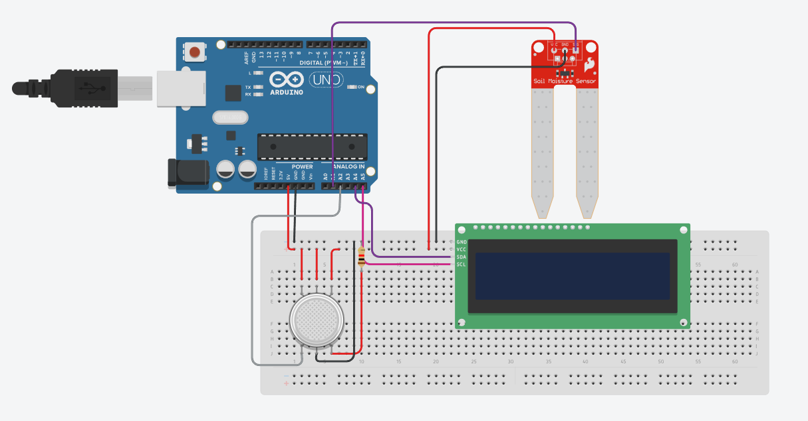

# Projeto de Sensor de CO2 e Umidade do Solo com Arduino

## Visão Geral

Este projeto foi desenvolvido para medir os níveis de dióxido de carbono (CO2) e a umidade do solo em manguezais, ambientes que possuem conexões importantes com os oceanos. Utilizando a plataforma Arduino e sensores específicos, nosso objetivo é fornecer dados precisos e em tempo real para monitorar esses fatores críticos e, assim, auxiliar na preservação e gestão sustentável dos manguezais.

## Componentes Utilizados

- Arduino Uno
- Sensor de CO2
- Sensor de Umidade do Solo
- Display LCD 16x2 com interface I2C
- Protoboard e Jumpers

## Circuito



## Vídeo


## Montagem

1. **Sensor de CO2**: Conecte o pino de saída do sensor de CO2 ao pino A2 do Arduino.
2. **Sensor de Umidade do Solo**: Conecte o pino de saída do sensor de umidade do solo ao pino A1 do Arduino.
3. **Display LCD**: Conecte os pinos SDA e SCL do display LCD aos pinos correspondentes no Arduino (A4 para SDA e A5 para SCL).
4. **Alimentação**: Certifique-se de que todos os componentes estejam devidamente alimentados.

## Código

```cpp
#include <Adafruit_LiquidCrystal.h>
 
Adafruit_LiquidCrystal lcd(0);

const int CO2Pin = A2;
const int soilMoisturePin = A1;

void setup() {
  Serial.begin(9600);
  
  lcd.begin(16, 2);
  lcd.setBacklight(LOW);
  lcd.print("Iniciando...");
  delay(2000);
}

void loop() {
  int CO2Value = analogRead(CO2Pin);
  int soilMoistureValue = analogRead(soilMoisturePin);

  Serial.print("CO2: ");
  Serial.print(CO2Value);
  Serial.print("\tUmidade do Solo: ");
  Serial.println(soilMoistureValue);

  lcd.clear();
  lcd.setCursor(0, 0);
  lcd.print("CO2: ");
  lcd.print(CO2Value);
  lcd.setCursor(0, 1);
  lcd.print("Umidade: ");
  lcd.print(soilMoistureValue);

  delay(1000); 
}
```
## Funcionamento

- **Inicialização**: Ao ligar, o sistema inicializa o display LCD e imprime a mensagem "Iniciando...".
- **Leitura de Sensores**: O Arduino lê continuamente os valores dos sensores de CO2 e umidade do solo.
- **Exibição dos Dados**: Os valores lidos são exibidos no display LCD e enviados para o monitor serial, permitindo um monitoramento em tempo real.

## Aplicações

Este projeto pode ser utilizado para:

- Monitoramento ambiental em manguezais.
- Estudos científicos sobre a saúde dos ecossistemas costeiros.
- Implementação de políticas de conservação ambiental mais eficazes.

## Tinkercad

https://www.tinkercad.com/things/hlFwnnSEwAW-sensor-de-co2-e-umidade-no-solo?sharecode=kOu7DtH_ZON3X4m3A4r_1kvZsn0lQCEhalz4Kmsmv3g

## Nomes e RMs

- **Nome**:	  Gustavo Oliveira de Moura	    **RM**: 555827
- **Nome**:	  Lynn Bueno Rosa			            **RM**: 551102
- **Nome**:	  Ygor Vieira Pontes          	 **RM**: 555686

